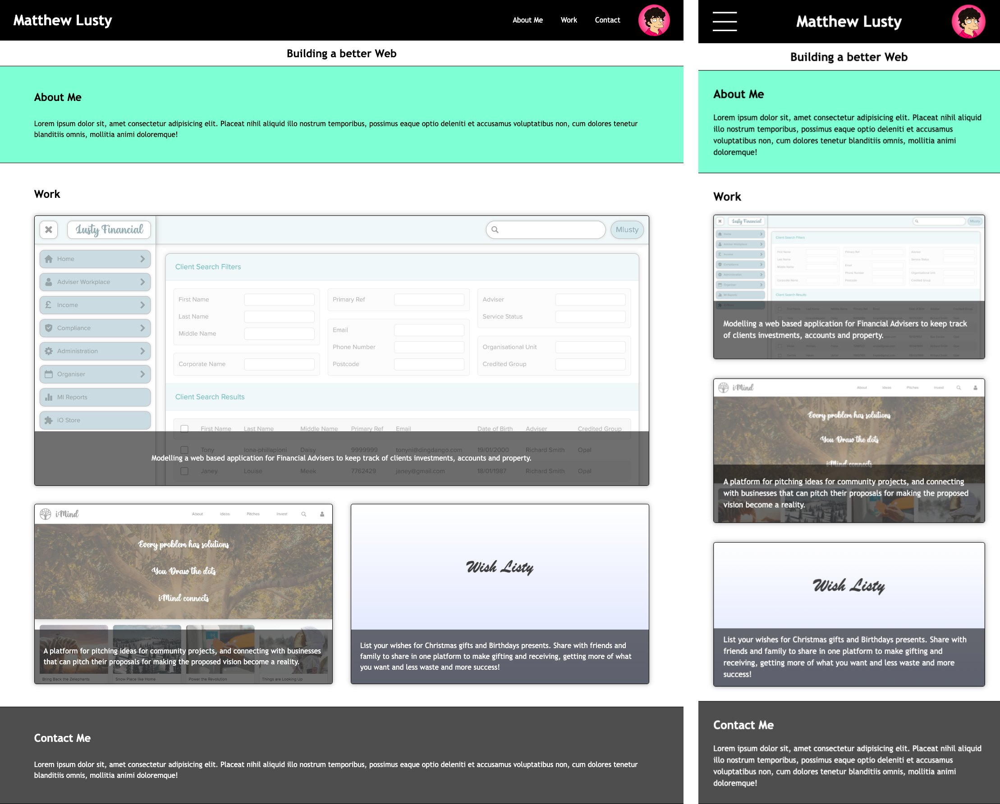

# bootcamp-portfolio

## Website

https://mattlusty.github.io/bootcamp-portfolio/

## Description

This is my web developer portfolio, which I will be adding throughout my design and coding journey.

I have put into practice some skills I have learnt, including

- responsive design using CSS media queries
- CSS Flexbox and Grid layouts

## Notes

1. Criteria: "the [work] section contains titled images of your applications"

- My Work Projects images all have a \<h3\> title in the HTML, however I made most of these invisible via CSS for design reasons, as the images themselves visually contain the website application titles, and I feel repeating these titles in the overlaid HTML uneccessary.

- I point this out because I realise one of the Acceptance Criteria for this challenge, is "the section contains titled images of your applications". So they are there in the HTML for accessibility and Searchability, they are just not visible by design!

2. Grading Requirement: "Application Quality: Application resembles the mock-up"

For the most part I have closely replicated the mock-up, however as this is my portfoli I asserting my right to choose not to follow the mock-up design choice of have Section headings to the left of each section, as I dislike that particular design choice.
